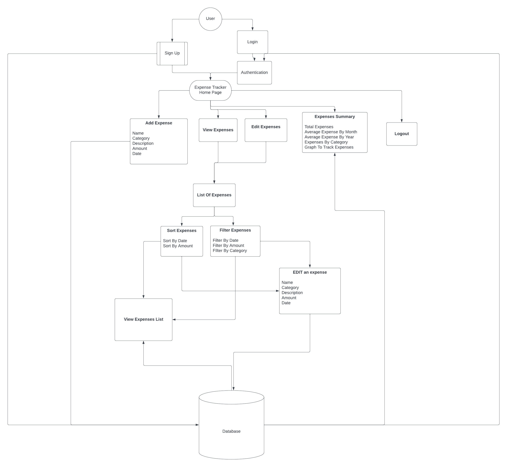
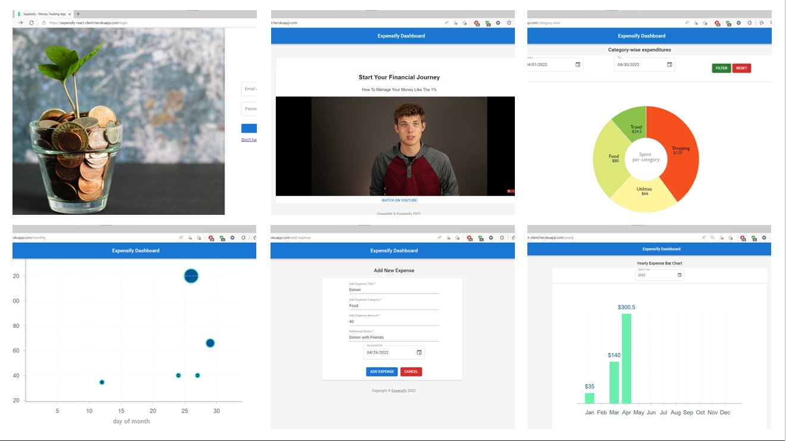

# Final Project - Expense Tracker App

# Web Design and User Experience Engineering

## Team Mates

- Pratik Gawand
- Sathwik Hegde
- Ganesh Kumar Dharani
- Shenckerr Gollapudi

# App URL

<https://expensify-react-client.herokuapp.com/login>

# Domain Model

# Application Summary

## User Stories

- User should be able to create an account
- User should be able to login with the acc
- User should be able to create an expense
- User should be able to edit an expense
- User should be able to view all the expenses
- User should be able to delete any expenses
- User should be able to view summary of the expenses
- User should be able to filter the expenses
- User should be user to sort the expenses
- User should be able to retrieve expenses data from the database any time
- Application should facilitate any number of accounts

## Features

- NodeJS
- ReactJS
- Express Validators
- AntD Component
- Redux
- SCSS / SASS

## Run Project

## React App

- To run React project `cd/client`
- Run `npm install`
- Type `npm run start`

## Node server

- To run React project `cd/server`
- Run `npm install`
- Type `npm run start` or `nodemon server.js`

## API Postman Collection

[Postman Collection](https://www.getpostman.com/collections/350ed45fe324d2aefbd3)

## Deployment

- `heroku login`

- `heroku create <app_name>`

- `git push heroku main`

## Libraries used in this application

    "Emotion":  <https://www.npmjs.com/package/@emotion/react>
    
    "Material UI": <https://mui.com/>
    
    "Axios": <https://axios-http.com/docs/intro>

    "Javascript-time-ago": <https://timeago.org/>
    
    "Notistack": <https://github.com/iamhosseindhv/notistack>
          
    "React-toastify": <https://aleab.github.io/toastify/>

## Reference

[Deployment](https://www.youtube.com/watch?v=2AIL1c-cJM0)

## License

The MIT License (MIT)

Copyright (c) 2022 Team Expensify

Permission is hereby granted, free of charge, to any person obtaining a copy of this software and associated documentation files (the "Software"), to deal in the Software without restriction, including without limitation the rights to use, copy, modify, merge, publish, distribute, sublicense, and/or sell copies of the Software, and to permit persons to whom the Software is furnished to do so, subject to the following conditions:

The above copyright notice and this permission notice shall be included in all copies or substantial portions of the Software.

THE SOFTWARE IS PROVIDED "AS IS", WITHOUT WARRANTY OF ANY KIND, EXPRESS OR IMPLIED, INCLUDING BUT NOT LIMITED TO THE WARRANTIES OF MERCHANTABILITY, FITNESS FOR A PARTICULAR PURPOSE AND NONINFRINGEMENT. IN NO EVENT SHALL THE AUTHORS OR COPYRIGHT HOLDERS BE LIABLE FOR ANY CLAIM, DAMAGES OR OTHER LIABILITY, WHETHER IN AN ACTION OF CONTRACT, TORT OR OTHERWISE, ARISING FROM, OUT OF OR IN CONNECTION WITH THE SOFTWARE OR THE USE OR OTHER DEALINGS IN THE SOFTWARE.
